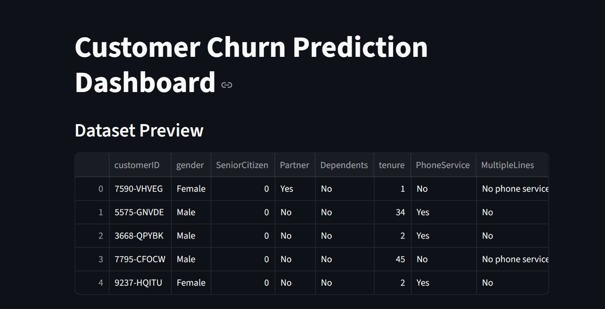
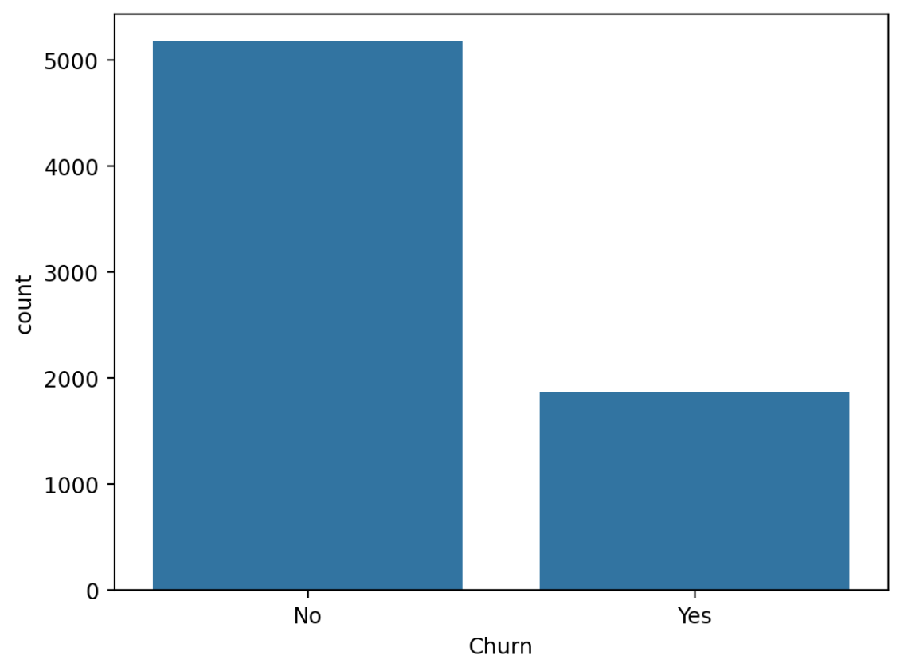
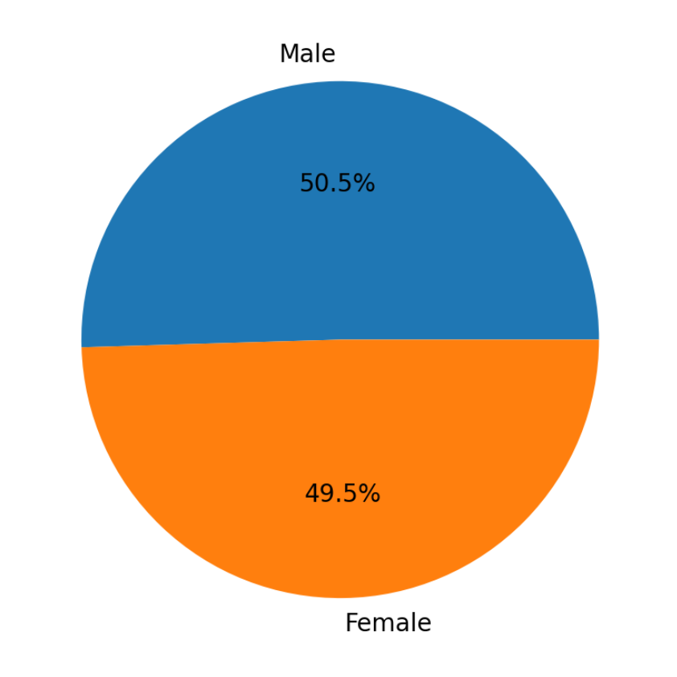
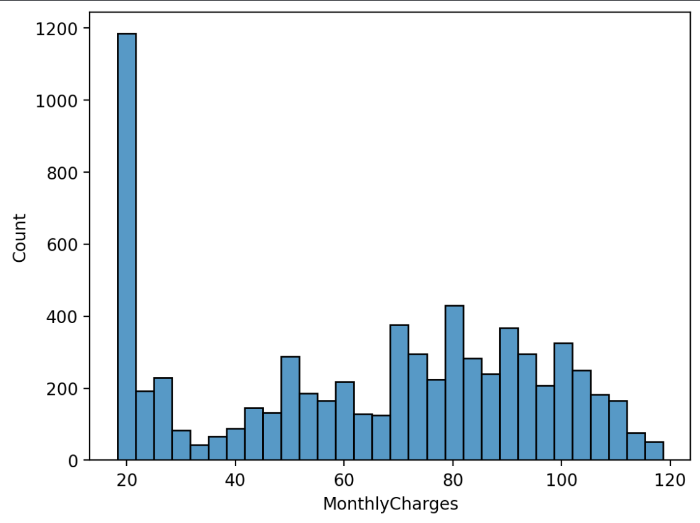
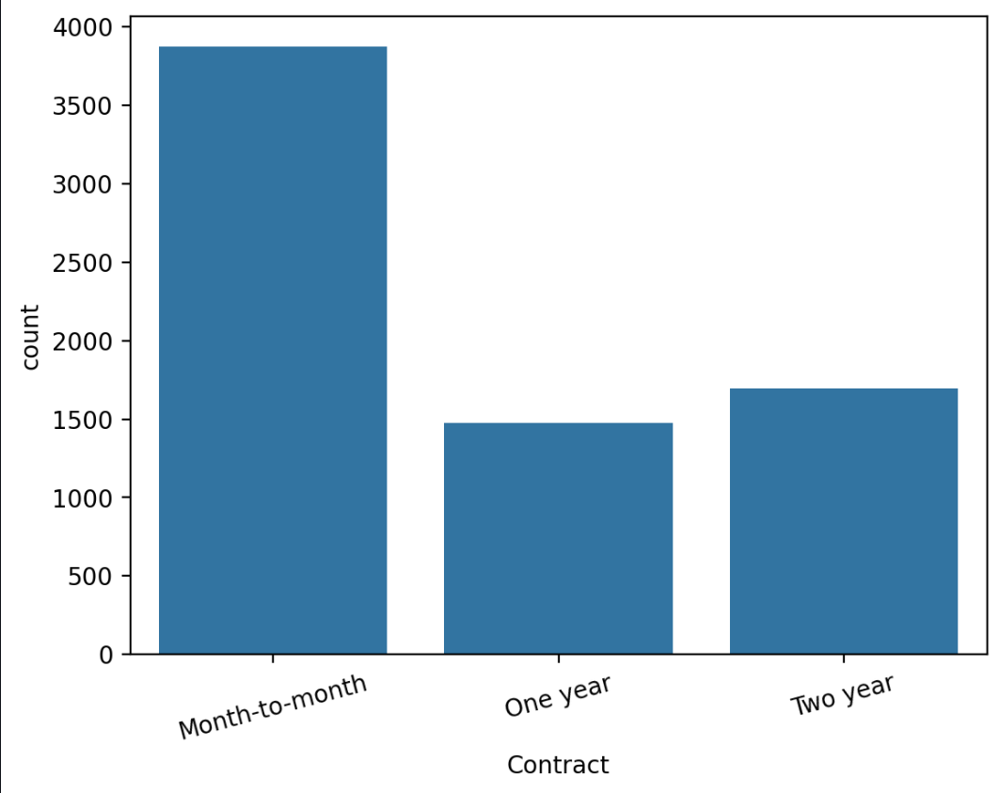
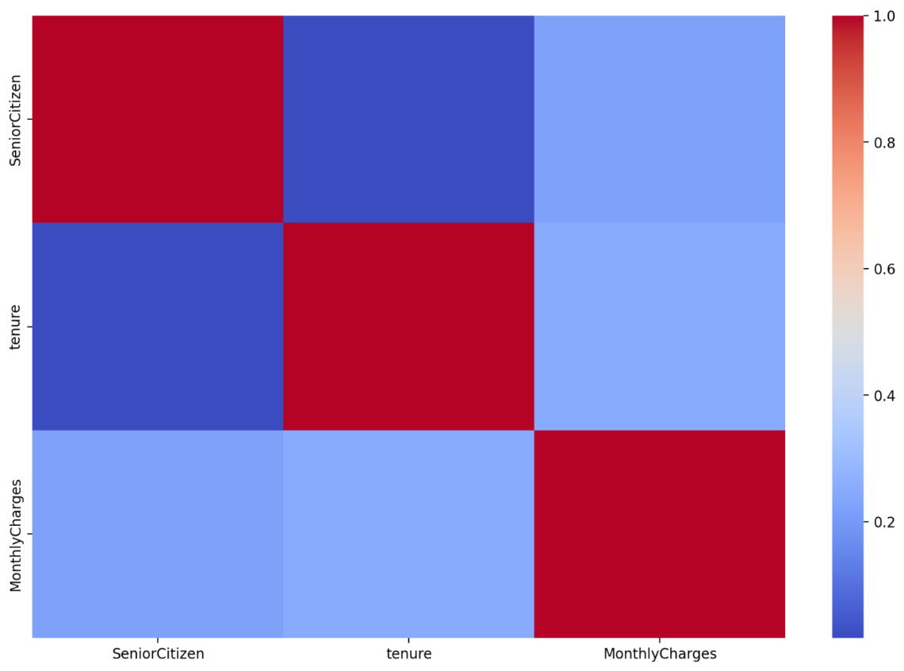

# Customer Churn Prediction and Visualization

## Project Overview
This project predicts customer churn using Machine Learning and visualizes customer behavior using interactive graphs and dashboards.

## Features
- Data Cleaning
- Data Visualization
- Churn Prediction
- Logistic Regression Model
- Accuracy Evaluation
- Streamlit Dashboard

## Technologies Used
- Python
- Pandas
- NumPy
- Seaborn
- Matplotlib
- Scikit-learn
- Streamlit

## Dataset
Telco Customer Churn Dataset

## Model Accuracy
81.69%

## Dashboard Preview

### Main Dashboard

### Churn Distribution

### Gender Distribution

### Monthly Charges Distribution

### Contract Type Analysis

### Heatmap

## Project Structure
data/
models/
src/
app.py

## How to Run

### Install Libraries
pip install -r requirements.txt

### Run Streamlit App
streamlit run app.py

## Future Improvements
- Random Forest
- XGBoost
- Cloud Deployment
- Real-time Predictions